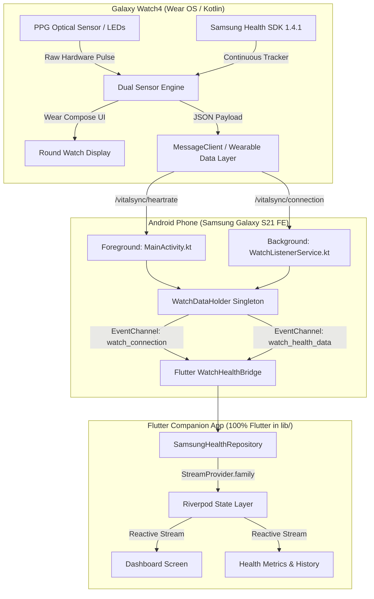

# VitalSync

VitalSync is a production-quality personal health monitoring and wellness application connecting a native Wear OS watch app (**Samsung Galaxy Watch4**) with a companion **Flutter mobile app** on Android. It collects live continuous biometric data, maintains bounded chronological time series, evaluates measurement quality, surfaces individual baselines and trends, and delivers actionable wellness insights.

> **Disclaimer**: VitalSync is not a medical diagnostic or treatment system. It is intended solely for personal wellness, fitness, and health tracking.

---

## 🏛 System Architecture



---

## 📱 Tech Stack & Component Responsibilities

| Layer | Technologies | Responsibilities |
|---|---|---|
| **Watch App (Wear OS)** | Kotlin, Jetpack Wear Compose, Material Theme | Round AMOLED UI, runtime permissions, dual-engine sensor tracking (Samsung SDK + `SensorManager`), Wearable Data Layer message dispatch. |
| **Phone Native Bridge** | Kotlin, Android SDK, Google Play Services Wearable | Proactive node detection (`NodeClient`), `WearableListenerService` background receiver, `WatchDataHolder` singleton with staleness tracking, `MethodChannel` & `EventChannel` endpoints. |
| **Mobile App (Flutter)** | Flutter 3.x, Dart, Material 3, Riverpod, GoRouter | 100% pure Flutter UI, reactive stream providers, bounded time-series health repositories, zero synthetic backfill when hardware is active, direct dashboard launch. |
| **Health Repositories** | Dart, Streams, AsyncValue | Repository pattern abstraction (`HealthRepository`), `SamsungHealthRepository` (real-time stream listener), `FakeHealthRepository` (clearly labeled simulated demo fallback). |

---

## 📂 Project Structure

```
VitalSync/
├── app/                                # Native Wear OS Watch App (Kotlin + Wear Compose)
│   ├── libs/
│   │   └── samsung-health-sensor-api-1.4.1.aar  # Official Samsung Health Sensor SDK
│   └── src/main/
│       ├── AndroidManifest.xml         # Biometric, health platform, & background permissions
│       └── java/com/example/vitalsync/
│           ├── MainActivity.kt         # Dual-engine PPG tracker, Wear Compose round UI
│           └── ui/theme/               # AMOLED-optimized Wear OS theme
├── android/app/src/main/kotlin/        # Native Android Companion Bridge
│   └── com/example/vitalsync/
│       ├── MainActivity.kt             # FlutterActivity, NodeClient check, EventChannels
│       ├── WatchDataHolder.kt          # Thread-safe data holder with 30s auto-degradation
│       └── WatchListenerService.kt     # WearableListenerService for background data sync
├── lib/                                # 100% Flutter Mobile Application
│   ├── core/
│   │   ├── routing/app_router.dart     # GoRouter configuration (direct dashboard launch)
│   │   └── theme/app_theme.dart        # Light & dark Material 3 themes
│   ├── data/
│   │   ├── models/                     # HealthMeasurement, WatchConnectionState, MetricType
│   │   ├── repositories/               # HealthRepository, SamsungHealthRepository, FakeHealthRepository
│   │   └── watch_bridge/               # WatchHealthBridge (Platform channel interface)
│   └── presentation/
│       ├── providers/                  # health_providers.dart, watch_connection_provider.dart
│       ├── screens/                    # Dashboard, Metrics, Insights, History, Profile
│       └── widgets/                    # Metric cards, status badges, empty states
└── test/                               # Comprehensive unit & widget test suite (27 tests)
```

---

## ⌚ Galaxy Watch4 Hardware & Sensor Integration

### Dual-Engine Optical PPG Tracking
1. **Primary Engine**: Samsung Health Sensor SDK (v1.4.1 `HealthTrackingService` & `HealthTracker`) reading continuous heart rate (`HealthTrackerType.HEART_RATE_CONTINUOUS` / `HEART_RATE`).
2. **Failover Engine**: Android Wear OS Platform `SensorManager` with `Sensor.TYPE_HEART_RATE` registered at `SENSOR_DELAY_FASTEST`. If Samsung SDK policy fails, the platform PPG sensor engages automatically.
3. **Wear OS 4+ / One UI Watch 5+ Security**: Declares and requests both `android.permission.BODY_SENSORS` and `android.permission.health.READ_HEART_RATE`.
4. **Hardware Off-Body Detection**: Respects the physical on-wrist state; accurately shows `Place watch on wrist` when not in skin contact and streams live BPM when pulse is acquired.

### Standardized Message Protocol
Biometric data is transmitted over the Google Play Services Wearable Data Layer (`/vitalsync/heartrate` and `/vitalsync/connection`) using a structured JSON payload:
```json
{
  "type": "heart_rate",
  "value": 74,
  "unit": "bpm",
  "timestamp": 1724835000000
}
```

---

## 🛠 Getting Started & Deployment

### Prerequisites
- **Flutter SDK**: `>= 3.24`
- **Android SDK**: API 34+ / Platform-Tools (`adb`)
- **Java**: JDK 17 (Temurin-17 recommended)
- **Devices**: Samsung Galaxy Watch4 (`SM_R870`) & Companion Android Phone (`SM_G990B2`)

### 1. Build and Run Mobile App (Phone)
```bash
# Get dependencies
flutter pub get

# Run static analysis
flutter analyze

# Run unit and widget tests
flutter test

# Build debug APK
flutter build apk --debug

# Install to connected phone via ADB
adb -s <phone-device-id> install -r build/app/outputs/flutter-apk/app-debug.apk
```

### 2. Build and Deploy Watch App (Galaxy Watch4)
```bash
# Build native Wear OS APK
export JAVA_HOME=/Library/Java/JavaVirtualMachines/temurin-17.jdk/Contents/Home
./gradlew :app:assembleDebug

# Sideload onto Galaxy Watch4 via Wireless Debugging
adb connect <watch-ip>:<watch-port>
adb -s <watch-ip>:<watch-port> install -r app/build/outputs/apk/debug/app-debug.apk

# Grant required hardware sensor permissions
adb -s <watch-ip>:<watch-port> shell pm grant com.example.vitalsync android.permission.BODY_SENSORS
adb -s <watch-ip>:<watch-port> shell pm grant com.example.vitalsync android.permission.BODY_SENSORS_BACKGROUND
adb -s <watch-ip>:<watch-port> shell pm grant com.example.vitalsync android.permission.ACTIVITY_RECOGNITION
adb -s <watch-ip>:<watch-port> shell pm grant com.example.vitalsync android.permission.health.READ_HEART_RATE
```

---

## 🧪 Testing & Verification

| Test Suite | File Path | Scope | Status |
|---|---|---|---|
| **Unit Tests** | `test/data/watch_bridge/watch_health_bridge_test.dart` | Bridge JSON parsing, error resilience, heartbeat filtering | ✅ **PASS** |
| **Repository Tests** | `test/data/repositories/samsung_health_repository_test.dart` | In-memory time series, zero synthetic backfill, bounding | ✅ **PASS** |
| **Simulation Tests** | `test/data/repositories/fake_health_repository_test.dart` | Stable baseline generation, simulated range constraints | ✅ **PASS** |
| **Widget Tests** | `test/widget_test.dart`, `dashboard_screen_test.dart` | Direct dashboard launch, reactive metrics cards, watch card | ✅ **PASS** |
| **Hardware Verification** | Galaxy Watch4 (`SM_R870`) ↔ Galaxy S21 FE (`SM_G990B2`) | Real optical PPG heart rate streaming over Wear OS Data Layer | ✅ **VERIFIED** |

---

## 📜 Development Guidelines & Principles

1. **Zero Synthetic Backfill**: Real hardware data is never mixed with fake fallback numbers. When the watch is connected, empty states are shown honestly until real sensor readings arrive.
2. **Pure Flutter Companion**: All mobile UI, state management, routing, and presentation logic reside exclusively in `lib/`.
3. **Decoupled Architecture**: UI elements depend only on `HealthRepository` interfaces, making sensor sources completely interchangeable.
